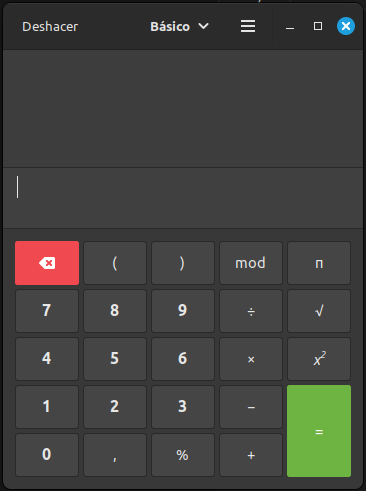

# Calculadora_JS_Vanilla
Se generará una calculadora_JS_Vanilla con funcionalidades básicas.

Como el objetivo de este repositorio es el código Javascript y no el diseño, nos basaremos el diseño de la calculadora de Linux. Se cambiarán algunas pequeñas funcionalidades.

